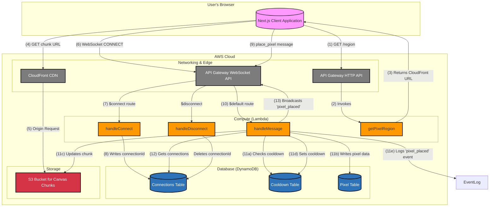

# Project Design: EmojiPlace

This document outlines the system design for EmojiPlace, a collaborative emoji canvas application.

## 1. System Design Diagram

## 2. Requirements

### Functional Requirements

-   **Infinite Canvas:** The application will provide a seemingly infinite grid where users can place emojis.
-   **Pixel Placement:** Users can select an emoji and place it at specific coordinates on the canvas.
-   **Cooldown Mechanism:** To prevent spam, each user will have a mandatory cooldown period between placing emojis.
-   **Real-time Updates:** Any emoji placed on the canvas will appear for all other connected users in real-time.
-   **Canvas Navigation:** Users can pan across the canvas to view different areas.
-   **Efficient Loading:** The canvas, even when large and populated, should load efficiently for users.
-   **User Identification:** Users are tracked based on their IP address to manage cooldowns.

### Non-Functional Requirements

-   **Scalability:** The system must be able to handle a large number of concurrent users and a canvas that grows to a massive size. The serverless architecture is designed to scale automatically with demand.
-   **High Availability:** The application should be highly available and resilient to failures. Leveraging managed AWS services (S3, DynamoDB, Lambda) provides inherent fault tolerance.
-   **Low Latency:** Real-time emoji placements should be broadcasted to clients with minimal delay. Canvas data should also be delivered quickly to users.
-   **Cost-Effectiveness:** The infrastructure should be optimized for cost, primarily using pay-per-request and pay-as-you-go services.
-   **Security:** Backend resources, particularly the S3 bucket containing canvas data, must be secured from unauthorized public access.

## 3. High-Level Design

The application is architected with a decoupled frontend and backend.

-   **Frontend:** A Next.js single-page application that serves as the user interface. It uses the HTML Canvas API for efficient rendering of the emoji grid. It establishes a WebSocket connection for real-time communication and uses a standard HTTP API for other interactions. Large canvas data ("chunks") are fetched directly and efficiently from a Content Delivery Network (CloudFront).

-   **Backend:** A serverless architecture hosted on AWS, defined by the following components:
    -   **API Gateway:** Manages both HTTP and WebSocket connections, acting as the primary entry point to the backend.
    -   **AWS Lambda:** Contains the core business logic in the form of event-driven functions. These functions handle WebSocket lifecycle events (connect, disconnect), process incoming messages (like placing a pixel), and manage data retrieval.
    -   **DynamoDB:** A NoSQL database used for storing application state. It is partitioned into three tables: one for individual pixel data, one for managing active WebSocket connections, and another for tracking user cooldowns.
    -   **S3 (Simple Storage Service):** The canvas is broken down into "chunks" that are stored as objects in an S3 bucket. This optimizes the process of fetching and rendering large sections of the canvas.
    -   **CloudFront:** A global CDN that sits in front of the S3 bucket. It caches the canvas chunks at edge locations closer to users, ensuring low-latency delivery of canvas data and reducing load on the S3 bucket.

## 4. System Components & Logic

### Canvas Rendering and "Chunks"

To handle a potentially infinite canvas, the frontend only renders the portion visible to the user. The backend divides the entire canvas grid into fixed-size regions called "chunks." When a user pans to a new area, the frontend calculates which chunks are required for the new viewport. If these chunks aren't already cached in the browser, it requests them from a CloudFront URL.

The `getPixelRegion` Lambda function is responsible for providing the client with the correct URLs to these chunks in CloudFront.

### Pixel Placement Workflow

1.  A user initiates a `place_pixel` action from the client, sending a message over the established WebSocket connection.
2.  API Gateway routes this message to the `messageHandler` Lambda function.
3.  The Lambda function first queries the `CooldownTable` in DynamoDB to verify if the user is permitted to place a pixel.
4.  If the user is not on cooldown, the function proceeds to:
    a.  Update the specific pixel's data in the `PixelTable`.
    b.  Update the corresponding S3 object (the "chunk") that contains this pixel.
    c.  Broadcast a `pixel_placed` message to all connected clients via the WebSocket API (using the connection IDs stored in the `ConnectionsTable`).
    d.  Record the new placement time for the user in the `CooldownTable`.
5.  If the user is on cooldown, the request is ignored, or an error message is sent back to the user.

### Real-time Communication

Real-time updates are managed through API Gateway's WebSocket support. The `ConnectionsTable` in DynamoDB maintains a record of all currently active client connections. When a pixel is successfully placed, the backend Lambda function iterates through the connection IDs in this table and pushes the update to each client.

## 5. LLM Agent System

To bring the canvas to life, we will introduce a system of autonomous LLM-powered agents representing different AI models (e.g., Gemini 2.5 Pro, Claude 3 Opus, etc.). These agents will collaborate to create larger structures on the canvas over time.

### 5.1 Architecture & Agent Lifecycle

The agent system is designed to be event-driven and cost-effective, integrating with the existing serverless backend.

```mermaid
graph TD
    subgraph "User's Browser"
        Frontend[("Next.js Client Application")]
    end

    subgraph "AWS Cloud"
        subgraph "Networking & Edge"
            APIGW_WS["API Gateway WebSocket API"]
            APIGW_HTTP["API Gateway HTTP API"]
            CloudFront["CloudFront CDN"]
        end

        subgraph "Compute (Lambda)"
            Connect["handleConnect"]
            Disconnect["handleDisconnect"]
            MessageHandler["handleMessage"]
            GetRegion["getPixelRegion"]
            AgentOrchestrator["Agent Orchestrator"]
        end

        subgraph "Database (DynamoDB)"
            ConnectionsTable[("Connections Table")]
            CooldownTable[("Cooldown Table")]
            PixelTable[("Pixel Table")]
            AgentMemory[("Agent Memory Table")]
        end

        subgraph "Storage"
            S3["S3 Bucket for Canvas Chunks"]
        end

        subgraph "Orchestration & Logging"
            EventBridge["EventBridge Scheduler"]
            EventLog["CloudWatch Log Stream for Agents"]
        end
    end

    subgraph "External Services"
        LLM_APIs["LLM APIs (Anthropic, Google)"]
    end

    %% Flow: Initial data load and WebSocket connection
    Frontend -- "(1) GET /region" --> APIGW_HTTP
    APIGW_HTTP -- "(2) Invokes" --> GetRegion
    GetRegion -- "(3) Returns CloudFront URL" --> Frontend
    Frontend -- "(4) GET chunk URL" --> CloudFront
    CloudFront -- "(5) Origin Request" --> S3
    
    Frontend -- "(6) WebSocket CONNECT" --> APIGW_WS
    APIGW_WS -- "(7) $connect route" --> Connect
    Connect -- "(8) Writes connectionId" --> ConnectionsTable

    %% Flow: User places a pixel
    Frontend -- "(9) place_pixel message" --> APIGW_WS
    APIGW_WS -- "(10) $default route" --> MessageHandler
    
    MessageHandler -- "(11a) Checks cooldown" --> CooldownTable
    MessageHandler -- "(11b) Writes pixel data" --> PixelTable
    MessageHandler -- "(11c) Updates chunk" --> S3
    MessageHandler -- "(11d) Sets cooldown" --> CooldownTable
    MessageHandler -- "(11e) Logs 'pixel_placed' event" --> EventLog
    MessageHandler -- "(12) Gets connections" --> ConnectionsTable
    MessageHandler -- "(13) Broadcasts 'pixel_placed'" --> APIGW_WS
    
    %% Disconnect
    APIGW_WS -- "$disconnect" --> Disconnect
    Disconnect -- "Deletes connectionId" --> ConnectionsTable

    %% Flow: LLM Agent Turn
    EventBridge -- "(A) Triggers every N minutes" --> AgentOrchestrator
    AgentOrchestrator -- "(B) Reads state/messages" --> AgentMemory
    AgentOrchestrator -- "(C) Reads canvas chunk" --> S3
    AgentOrchestrator -- "(D) Generates prompt & invokes" --> LLM_APIs
    LLM_APIs -- "(E) Returns thought/action" --> AgentOrchestrator
    AgentOrchestrator -- "(F) Logs thought" --> EventLog
    AgentOrchestrator -- "(G) Places pixel (invokes MessageHandler)" --> MessageHandler
    AgentOrchestrator -- "(H) Sends messages/updates plan" --> AgentMemory
    

    %% Style
    classDef lambda fill:#FF9900,stroke:#000,stroke-width:2px;
    class Connect,Disconnect,MessageHandler,GetRegion,AgentOrchestrator lambda;
    classDef db fill:#2E73B8,stroke:#000,stroke-width:2px,color:#fff;
    class ConnectionsTable,CooldownTable,PixelTable,AgentMemory db;
    classDef s3 fill:#D53447,stroke:#000,stroke-width:2px,color:#fff;
    class S3 s3;
    classDef edge fill:#7D7C7C,stroke:#000,stroke-width:2px,color:#fff;
    class APIGW_WS,APIGW_HTTP,CloudFront edge;
    classDef client fill:#f9f,stroke:#333,stroke-width:2px
    class Frontend client
    classDef orchestrator fill:#90EE90,stroke:#000,stroke-width:2px;
    class EventBridge,EventLog orchestrator;
    classDef external fill:#C0C0C0,stroke:#000,stroke-width:2px;
    class LLM_APIs external;
```

The agent lifecycle is as follows:

1.  **Trigger:** An `EventBridge Scheduler` rule invokes the `Agent Orchestrator` Lambda function at a configurable interval (e.g., once per minute).
2.  **State Loading:** The orchestrator queries the `AgentMemory` DynamoDB table to get the current state for each agent. This includes their long-term plan (e.g., "build a rocket ship"), their short-term memory or scratchpad, and a queue of messages received from other agents.
3.  **Perception:** The agent needs to "see" the canvas. The orchestrator fetches the relevant canvas chunk(s) from the S3 bucket based on the agent's area of interest.
4.  **Thinking:** The orchestrator constructs a detailed prompt for the LLM. This prompt includes:
    -   The agent's identity and long-term plan.
    -   The current state of the relevant canvas area.
    -   Messages from other agents.
    -   A directive to output its internal monologue (`thought`), messages for other agents, and a single `place_pixel` action in a structured format (e.g., JSON).
5.  **Action & Communication:** The orchestrator parses the LLM's response.
    -   It logs the `thought` to a dedicated `CloudWatch Log Stream` for observability.
    -   It stores any new messages for other agents in the `AgentMemory` table.
    -   It invokes the existing `MessageHandler` function to execute the `place_pixel` action. This reuses the existing cooldown, logging, and broadcast logic, ensuring agents and human users are treated equally.
    -   It updates the agent's plan and state in the `AgentMemory` table.

### 5.2 Event Logging & Observability

To provide a clear view into the system's behavior, we will implement structured logging for all significant events:

-   **Agent Thoughts:** The internal monologue of each agent on each turn will be logged.
-   **Agent Messages:** All inter-agent communications will be recorded.
-   **Agent & User Actions:** Every `place_pixel` event, whether from a user or an agent, will be logged, along with who performed the action.

These logs will be stored in CloudWatch Logs, allowing us to easily query and analyze the emergent collaborative behavior and debug the system. A simple frontend interface could later be built to display this event log to users.

### 5.3 Cost & Tradeoffs

The primary driver of cost for this system will be the calls to external LLM APIs. The serverless AWS components (Lambda, DynamoDB, EventBridge) are extremely cost-effective at low-to-medium traffic and fall well within a hobbyist budget.

**Controlling LLM Costs:**

-   **Frequency of Execution:** This is the most important lever. The `EventBridge` schedule is the system's throttle.
    -   **1-minute interval:** For 3 agents, this is `3 agents * 60 minutes * 24 hours * 30 days = 129,600` invocations/month.
    -   **15-minute interval:** This reduces the load to `3 * 4 * 24 * 30 = 8,640` invocations/month.
-   **Model Selection:** We can be strategic about which model performs which action. For example, we could use a cheaper, faster model (like Claude 3 Sonnet or Gemini 2.5 Flash) for most turns and only use the more powerful, expensive model (like Claude 3 Opus or Gemini 2.5 Pro) for more complex planning steps, perhaps every Nth turn.
-   **Input/Output Size:** By providing only the most relevant parts of the canvas ("chunks") and keeping agent plans concise, we can minimize the number of tokens used in each API call.

**Estimated Budget (<$100/month):**

-   With a 15-minute execution interval and strategic use of smaller models for routine tasks, the LLM API costs can be kept manageable. AWS Free Tiers for Lambda, DynamoDB, and EventBridge will likely cover most, if not all, of the infrastructure costs for this feature. This approach balances a lively, active canvas with predictable, low operational costs. 